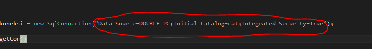
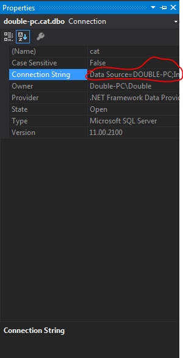
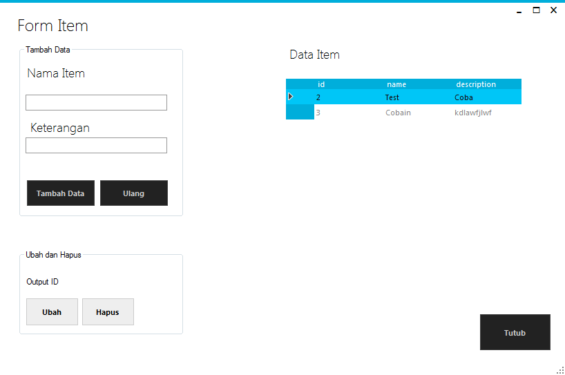

# CUCUR :cake:

### Sekilas tentang cucur


Kue cucur merupakan makanan tradisional , biasa ditemukan di seluruh plosok pasar tradisional indonesia , deskripsi liyane golek o nek gugel iki mek gawe peralihan tok :joy:

### Konfigurasi Project

Buka DAL -> DBConnection.cs ,koneksi string ganti punya agan 



Di server explorer klik database , klik properties


Cara nggolek i ne ngeten , koneksine string e gentien karo iki



### Database 
- Masih Pake SQL Server , Mysql entar nyusul 

Bikin db namanya cucurDB , terus execute query ini

```

USE [master]
GO
/****** Object:  Database [cucurDB]    Script Date: 12/19/2016 5:30:50 PM ******/
CREATE DATABASE [cucurDB]
 CONTAINMENT = NONE
 ON  PRIMARY 
( NAME = N'cucurDB', FILENAME = N'C:\Program Files\Microsoft SQL Server\MSSQL11.MSSQLSERVER\MSSQL\DATA\cucurDB.mdf' , SIZE = 4096KB , MAXSIZE = UNLIMITED, FILEGROWTH = 1024KB )
 LOG ON 
( NAME = N'cucurDB_log', FILENAME = N'C:\Program Files\Microsoft SQL Server\MSSQL11.MSSQLSERVER\MSSQL\DATA\cucurDB_log.ldf' , SIZE = 1024KB , MAXSIZE = 2048GB , FILEGROWTH = 10%)
GO
ALTER DATABASE [cucurDB] SET COMPATIBILITY_LEVEL = 110
GO
IF (1 = FULLTEXTSERVICEPROPERTY('IsFullTextInstalled'))
begin
EXEC [cucurDB].[dbo].[sp_fulltext_database] @action = 'enable'
end
GO
ALTER DATABASE [cucurDB] SET ANSI_NULL_DEFAULT OFF 
GO
ALTER DATABASE [cucurDB] SET ANSI_NULLS OFF 
GO
ALTER DATABASE [cucurDB] SET ANSI_PADDING OFF 
GO
ALTER DATABASE [cucurDB] SET ANSI_WARNINGS OFF 
GO
ALTER DATABASE [cucurDB] SET ARITHABORT OFF 
GO
ALTER DATABASE [cucurDB] SET AUTO_CLOSE OFF 
GO
ALTER DATABASE [cucurDB] SET AUTO_CREATE_STATISTICS ON 
GO
ALTER DATABASE [cucurDB] SET AUTO_SHRINK OFF 
GO
ALTER DATABASE [cucurDB] SET AUTO_UPDATE_STATISTICS ON 
GO
ALTER DATABASE [cucurDB] SET CURSOR_CLOSE_ON_COMMIT OFF 
GO
ALTER DATABASE [cucurDB] SET CURSOR_DEFAULT  GLOBAL 
GO
ALTER DATABASE [cucurDB] SET CONCAT_NULL_YIELDS_NULL OFF 
GO
ALTER DATABASE [cucurDB] SET NUMERIC_ROUNDABORT OFF 
GO
ALTER DATABASE [cucurDB] SET QUOTED_IDENTIFIER OFF 
GO
ALTER DATABASE [cucurDB] SET RECURSIVE_TRIGGERS OFF 
GO
ALTER DATABASE [cucurDB] SET  DISABLE_BROKER 
GO
ALTER DATABASE [cucurDB] SET AUTO_UPDATE_STATISTICS_ASYNC OFF 
GO
ALTER DATABASE [cucurDB] SET DATE_CORRELATION_OPTIMIZATION OFF 
GO
ALTER DATABASE [cucurDB] SET TRUSTWORTHY OFF 
GO
ALTER DATABASE [cucurDB] SET ALLOW_SNAPSHOT_ISOLATION OFF 
GO
ALTER DATABASE [cucurDB] SET PARAMETERIZATION SIMPLE 
GO
ALTER DATABASE [cucurDB] SET READ_COMMITTED_SNAPSHOT OFF 
GO
ALTER DATABASE [cucurDB] SET HONOR_BROKER_PRIORITY OFF 
GO
ALTER DATABASE [cucurDB] SET RECOVERY FULL 
GO
ALTER DATABASE [cucurDB] SET  MULTI_USER 
GO
ALTER DATABASE [cucurDB] SET PAGE_VERIFY CHECKSUM  
GO
ALTER DATABASE [cucurDB] SET DB_CHAINING OFF 
GO
ALTER DATABASE [cucurDB] SET FILESTREAM( NON_TRANSACTED_ACCESS = OFF ) 
GO
ALTER DATABASE [cucurDB] SET TARGET_RECOVERY_TIME = 0 SECONDS 
GO
EXEC sys.sp_db_vardecimal_storage_format N'cucurDB', N'ON'
GO
USE [cucurDB]
GO
/****** Object:  Table [dbo].[Item]    Script Date: 12/19/2016 5:30:50 PM ******/
SET ANSI_NULLS ON
GO
SET QUOTED_IDENTIFIER ON
GO
SET ANSI_PADDING ON
GO
CREATE TABLE [dbo].[Item](
	[id] [int] IDENTITY(1,1) NOT NULL,
	[name] [varchar](50) NOT NULL,
	[description] [varchar](50) NOT NULL,
 CONSTRAINT [PK_Item] PRIMARY KEY CLUSTERED 
(
	[id] ASC
)WITH (PAD_INDEX = OFF, STATISTICS_NORECOMPUTE = OFF, IGNORE_DUP_KEY = OFF, ALLOW_ROW_LOCKS = ON, ALLOW_PAGE_LOCKS = ON) ON [PRIMARY]
) ON [PRIMARY]

GO
SET ANSI_PADDING OFF
GO
USE [master]
GO
ALTER DATABASE [cucurDB] SET  READ_WRITE 
GO


```

### Showcases




### Author 
[Ivan Fadila Putra](https://github.com/ffadilaputra) 

### Referensi
- [Metro UI by Dennis Magno ](https://github.com/dennismagno/metroframework-modern-uia)
- [Understand 3-Tier Architecture in C#](https://www.codeproject.com/tips/662107/understand-tier-architecture-in-csharp)

